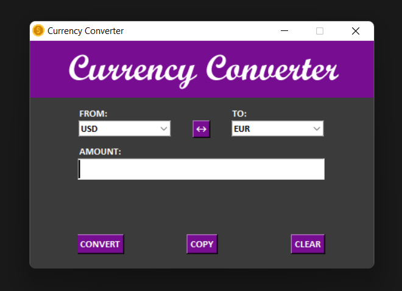

  
   

# Currency Converter

## Description

Are you planning a trip to another country? Do you know what currency to use when you hand over your credit card to the owner of a hotel, restaurant or shop and they ask if you want to pay with local or home money? One option can be significantly more expensive than the other.

This Currency Converter can be used to convert your money from one currency to another. More than 50 currencies are mentioned, including such well-known ones as the US dollar, the pound, the euro, the yen, and the Swiss franc, amongst others.

## Features
- 💻 This tool works over the internet
- 📊 Exchange rate data is taken from the official website of the [National Bank of Ukraine](https://bank.gov.ua/)

## Link
- [Download](https://github.com/)