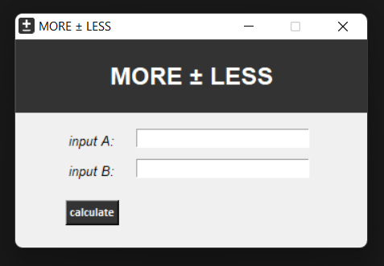

  
   

# MORE ± LESS

## Description

The MORE-LESS tool can be used in the process of solving a fairly wide range of problems (accounting calculations, mathematical problems, etc.), it will help you calculate by what percentage one number is more / less than another, calculate the percentage change.
