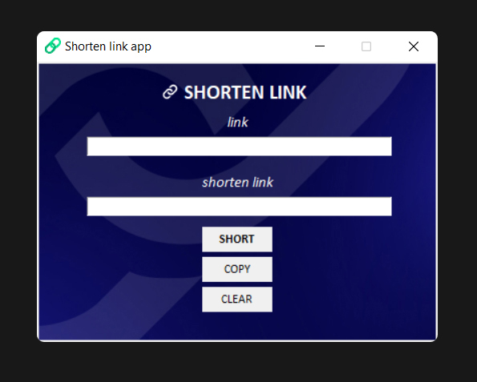

  
   

# SHORTEN LINK

## Description

Long links look unaesthetic and are often inconvenient to use. Short links look better and are easier to use. 

This tool generates a short URL using [pyshorteners](https://pypi.org/project/pyshorteners/) lib.
  

### A short url should be used if needed:
- send the link in the messenger or dictate
- mask referral links
- make the link visually appealing
- save space in messages of limited length
- prevent incorrect copying (cutting) of long links
  

## Features
- 💻 This tool works over the internet
  

## Link
- [Download](https://github.com/)