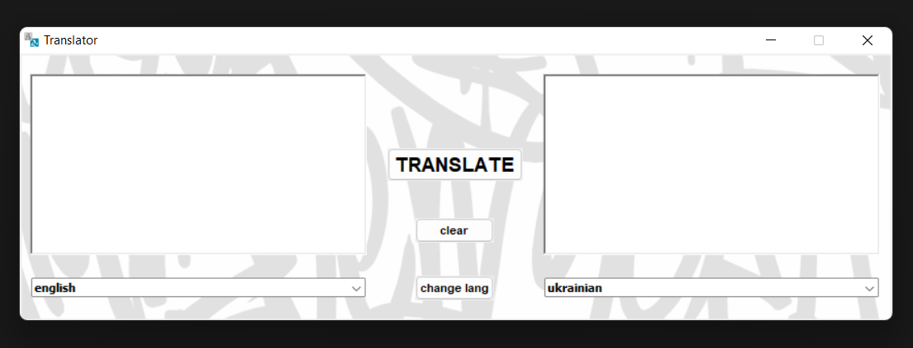

  
   

# TRANSLATOR

## Description

The translator is suitable for both one-time translations and regular translations (work, education, etc.). This tool with a simple and user-friendly interface, supports more than 100 languages and provides coherent translation.

The translation process is implemented using [googletrans](https://pypi.org/project/googletrans/) lib.

## Features
- 💻 This tool works over the internet
- 🆎 Supports more than 100 languages
